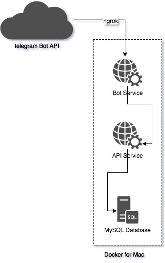
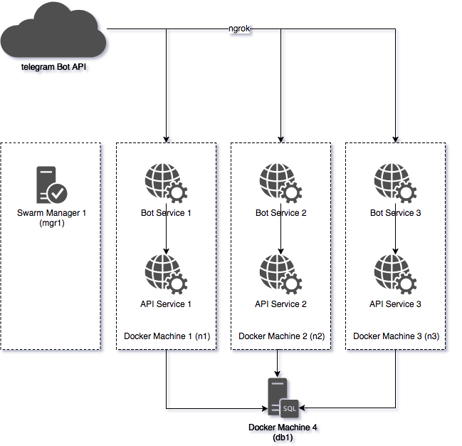

Docker Compose & Swarm Keynote Sample Codes
-------------------------------------------

This repository includes the code samples I've written for the keynote I've presented at the Docker İzmir's 2nd meetup.
It basically demonstrates what Docker Compose does on a single machine and how useful it can be in Swarm mode. Samples
include a database (MySQL), an API (Java 8 & Spring Boot) and a NodeJS app to act as
a [Telegram](https://core.telegram.org/api) bot.

Before starting, I suggest you to use [tmux](https://tmux.github.io/) so that you can split your terminal screen in
order to have a better view of the setup process.

**TODO:** Screenshot of tmux in action

# Usage

After running the application in Docker Compose, you may interact with the bot in following ways:

* `/start` will register you into the database and reply with a greeting message using the container ID (to prove it's
  really scaling)
* `/hello` command will reply back with a greeting message using the container ID.
* Any message will be logged into the database with the user's details who sends the message.
* Any sticker sent to the bot will result with a surprize :)

# Dependencies

* docker >= 17.03
* docker-compose >= 1.11.2
* docker-machine >= 0.10.0
* ngrok >= 2.2.4
* virtualbox (for swarm mode)

# Single Machine Mode



We create a network called `izmir_demo` to isolate our containers from the rest of the system. Compose will create this
network before creating anything else.

After the network creation, 4 services will be created:

* proxy
* api
* bot
* db

**proxy** is based on [nginx-proxy](https://github.com/jwilder/nginx-proxy) which auto generates an nginx config file by
tracking the events triggered inside Docker Engine. (on the host machine) This is to load balance requests coming from
Telegram to the bot containers. `nginx-proxy` uses the `Host` header to proxy the requests to the correct backend
service. That's why we're setting the `VIRTUALHOST` variable inside the `.env` file below in configuration section.

**api** is a Java 8 (Spring Boot) app which creates a user account following the first message of a user and then
stores the message into the database. It uses `DB_HOST` environment variable to find the database inside the network
which is eventually set to `db` by Docker Compose. The API service uses a special bash script to wait for MySQL to
become fully available because it'd fail otherwise (due to the lack of a working database). This is also the only
reason we're overriding the image's default command.

**bot** is a NodeJS app which interacts with Telegram API via a webhook. During the initialization of the app, it
registers itself to Telegram API using the environment variable `BOT_HOST`. There is also another environment variable
called `VIRTUAL_HOST` which is detected by **proxy** service to update its own config. The service also uses
`BOT_TOKEN` to prove its identity to Telegram and `API_HOST` to connect to the API service inside the network. The bot
token is fetched from the `.env` file while api host is hardcoded inside compose file. (so it uses API service's name
which is registered to the network by Docker Compose)

**db** is a MySQL database with a custom container image. Usually we wouldn't need a custom image at all but we did for
the following reasons:

* To create & initialize the database using a SQL script
* To set collation and character set of the database to UTF-8

In this scenario, you may only scale the **bot** service since we're not load balancing **api** service at all.

## Provisioning

Assuming you already have Docker installed, no additional provisioning is needed.

## Configuration

First, grab a token for your bot using [BotFather](https://telegram.me/BotFather) (if you haven't already). You'll need
it to setup webhooks for your Telegram bot so that bot service can receive messages sent to your bot. After creating
your token, create a file called `.env` in the root of the project and append the following line:

```
BOT_TOKEN=4315155553:AAEuMasdasdasdasdq34314pb1Qtrdem_asdas2414gff
```

Now start `ngrok` via the following command:

```
$ ngrok http --region eu 9999
```

This command will start `ngrok`'s UI and show the public host for your service. Append the following line into your
`.env` file:

```
VIRTUALHOST=9970a02d.eu.ngrok.io
```

Make sure the hostname is same with the output of `ngrok`. **Note:** You need to change this everytime you start
`ngrok`.

## Running

If you've created the `.env` file, you can start the app with the following command:

```
$ docker-compose up -d
```

You may also pass all environment variables without needing to change or create `.env` file:

```
$ BOT_TOKEN=4315155553:AAEuMasdasdasdasdq34314pb1Qtrdem_asdas2414gff \
VIRTUAL_HOST=9970a02d.eu.ngrok.io \
docker-compose up -d
```

## Testing

Try saying `/hello` to the bot or anything mentioned at the top of this file. :)


# Swarm Mode



## Provisioning

Create the following VM's using Docker Machine. We'll stick with [Virtualbox](https://www.virtualbox.org/) for the
sample app but you can easily change the parameters to create the VM's on [DigitalOcean](https://m.do.co/c/d1abf7f7d07e)
(*note: referral link*) or [AWS](https://aws.amazon.com/).

```
$ docker-machine -d virtualbox mgr1
$ docker-machine -d virtualbox --engine-label role=node n1
$ docker-machine -d virtualbox --engine-label role=node n2
$ docker-machine -d virtualbox --engine-label role=node n3
$ docker-machine -d virtualbox --engine-label role=db db
```

Connect to the manager and create a swarm:

```
$ eval $(docker-machine env mgr1)
$ docker swarm init --advertise-addr $(dm ip mgr1)
```

## Configuration

First start `ngrok` via the following command:

```
$ ngrok http --region eu 192.168.99.100:3000
```

## Running

Since we're not using a secret management service or anything alike to share configuration, we have to pass environment
variables through CLI as docker stack cannot load `.env` files. You can start the app with the following command:

```
$ BOT_TOKEN=4315155553:AAEuMasdasdasdasdq34314pb1Qtrdem_asdas2414gff \
VIRTUAL_HOST=9970a02d.eu.ngrok.io \
docker stack deploy -c docker-compose-swarm.yml demo
```

## Testing

Try saying `/hello` to the bot or anything mentioned at the top of this file. :)
